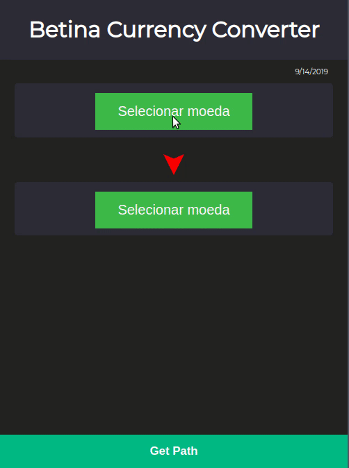

<h1 align="center"> Projeto Betina Currency </h1>

Esse projeto tem o objetivo de encontrar a melhor 
sequência de cambios de uma moeda para outra.

# Resultado

<p align="center">
	
</p>

# Como rodar o projeto

Crie uma Virtual Env usando o Python 3
```
virtualenv -p python3 env
```

Instale os prerequisitos
```
pip install -r requirements.txt
```

Execute o server da aplicação
```
python api/apy.py
```

Abra o localhost na porta 5000

[http://localhost:5000](http://localhost:5000)

# Cenário

Imagine o seguinte cenário. Você tem R$1.000 Reais e quer converter Rublos.
Porém essa conversão não é comum em casas de câmbio, e a maioria delas 
somente trocam real para dolar ou euro.

Você conhece uma outra casa de câmbio que tem Rublos para trocar, porém ela 
só aceita dolar e euro.

Bem, eu posso primeiro comprar dolar/euro e depois trocar para rublos. Mas 
será que tanto faz o caminho real->euro->rublo ou real->dolar->rublo? 
Será que o montante final é o mesmo?

# Simulação

As taxas de câmbio dessa simulação foi baseada nos valores monetários do dia 1 de setembro de 2019, com base no site da [Uol](https://economia.uol.com.br/cotacoes/cambio/).

## 1° Cenário

Eu primeiro faço o câmbio de R$1.000,00 Reais para $241.42 Dolares
<p align="center">
  
</p>

Então faço o câmbio de $241.42 Dolares para ‎₽16.128,80 Rublos.
<p align="center">
  
</p>

#### **Resultado** 

Ok, no primeiro cenário consegui ‎₽16.128,80 Rublos

## 2° Cenário

Agora vamos fazer o câmbio de R$1.000,00 Reais para 
€219,40 Euros
<p align="center">
  
</p>

E então fazemos o câmbio de €219,40 Euros para ₽16.129,08 Rublos
<p align="center">
  
</p>

#### **Resultado** 
Ok, no segundo cenário consegui ₽16.129,08 Rublos

## Opa! 

Eu fiquei com ₽0,28 centavos de Rublos a mais quando fiz o 
caminho Real -> Euro -> Rublo

Parece besteira né, mas e se fosse R$1.000.000,00 de reais? 
Aí eu teria ₽280 a mais...

Bem... Continua parecendo besteira.

## E se...

Mas agora imagina que eu saia com os meus ₽16.129,08 Rublos
e encontre uma terceira corretora que faça o câmbio Rublo-Real.

Lá eu descubro que os meus ₽16.129,08 Rublos podem ser 
trocados por R$1.001,65 Reais!!!
<p align="center">
  
</p>

## Opa! Comecei com R$1.000,00 e terminei com R$1.001,65

# Agora é só farmar

<p align="center">
  
</p>

## Hmm... Não sei não Rick...

Bem... Talvez não seja tão simples assim... Existem taxas 
de câmbio.. Se você quiser comprar 1 milhão de euros talvez 
a casa de câmbio não tenha... E se isso funcionasse eu não 
estaria aqui contando pra você...

Maaaaaaas o escopo desse projeto será simples sim!!

E se eu fiquei Bilionário foi porque eu mereci!!

<p align="center">
  
</p>

# Objetivo

Modelar um grafo ponderado direcionado com as cotações monetárias de diversas casas de câmbio.

As informações que precisam ser obtidas são:
    
* Qual é a melhor sequência de cambio de uma moeda para outra.

* Existe algum ciclo positivo?

# Algoritmo

Com base no requisito de poder descobrir o menor caminho 
de uma moeda para qualquer outra moeda, uma boa abordagem 
seria utilizar o algoritmo de [Bellman Ford](https://github.com/edsomjr/TEP/blob/master/Grafos/slides/SSP-1/SSP-1.pdf).

Este algoritmo computa o caminho mínimo de todas as moedas dada uma moeda 
inicial.

Esse algoritmo é versátil e consegue computar grafos com arestas com peso 
negativo, sendo esse o principal motivo para sua escolha.

Sua complexidade é O(VE), sendo V o número de vértices e E o número de 
arestas.

# APIS de câmbio de moedas
- https://fixer.io/ (Somente EUR -> Outras Moedas)
- https://exchangeratesapi.io/
- https://currencylayer.com/ (Somente USD -> Outras Moedas)
- https://docs.openexchangerates.org/ (Somente USD -> Outras Moedas)
- https://www.currencyconverterapi.com/

# Postmortem

O objetivo inicial desse projeto era farmar dinheiro atráves de ciclos 
negativos entre a conversão de moedas. Porém, por conta de diversos problemas 
encontrados o escopo foi reduzido para encontrar o melhor caminho não direto 
de conversão entre duas moedas.

## Problema 1 - Não conseguimos reproduzir o caminho do ciclo negativo encontrado

Após o processamento do grafo formado pelas cotações do dia 11 de setembro 
de 2019, era possível transformar 1 BRL em aproximadamente 2500 USD. 
Essa conversão foi possível pois o algoritmo encontrou um ciclo negativo 
entre as moedas MXC -> JPY -> SAR -> MXC, onde a cada ciclo era possível 
gerar 4 centavos. Como toda vez que ocorria esse ciclo a "distância" entre 
as moedas diminuia, o algorítmo utilizou essa caminho N vezes até o final de 
sua execução.

O algoritmo conseguia informar a taxa resultante desse caminho, porém não era 
possível reproduzir o caminho encontrado, devido o fato do ciclo uma vez 
formato ser autocontido, não tento um antecessor que o descobriu.

O algoritmo de bellman ford, realiza durante E (qnt de arestas) execuções o 
relaxamento das distâncias. Isso é, para cada aresta processada ele verifica 
se essa aresta melhora algum caminho, caso melhore ele atualiza a matriz de 
predecessores, que futuramente será usada para reproduzir o caminho de uma 
moeda para outra.

O problema é, quando existe ciclos negativos toda execução do algoritmo o 
caminho do ciclo é tomado, uma vez que ele 'diminui' a distância entre as 
moedas, e atualiza o predecessor da moeda processada.

Por exemplo, imagine que quero encontrar o melhor caminho da moeda 
BRL para JPY. Vamos supor que o caminho encontrado seja :
```
BRL -> USD -> EUR -> MXC -> EUR -> MXC -> ... -> MXC -> JPY.
```

Observe que há um ciclo negativo entre a moeda EUR e MXC. Quando isso 
acontece, o predecessor do EUR é o MXC e do MXC é o EUR.

Desse modo quando vamos tentar refazer o caminho partindo da moeda destino 
para a moeda de origem o seguinte cenário ocorre:

Primeiro achamos o predecessor da moeda JPY
```
JPY <- MXC
```
Agora o predecessor da moeda MXC
```
JPY <- MXC <- EUR
```
E agora o problema ocorre. Quando tentamos achar o predecessor da moeda EUR 
voltamos para a moeda MXC:
```
JPY <- MXC <- EUR <- MXC <- EUR <- MXC <- EUR <- ...
```
Quando voltamos para um moeda que já foi vista nesse caminho, perdemos a 
trilha para a moeda de origem, não sendo possível reproduzir o caminho.

Quando visualizamos esse problema, tentamos resolver durante alguns dias, 
mas devido o curto prazo de entrega e a diculdade de ambos os  
desenvolvedores para trabalhar no frontend, foi decidido que o escopo do 
projeto seria encontrar o melhor caminho entre duas moedas ignorando os 
ciclos negativos.

## Problema 2

Quando removido os ciclos negativos, a melhor conversão nos casos onde havia 
a aresta conectado as duas moedas era a conversão direta. E como o grafo 
montado é densamente conectado, isso é, quase todas as moedas tinham conexão 
com quase todas as outras moedas, fazia com que o problema a ser resolvido 
com grafo se resumisse a uma simples conversão direta, o que tirou toda a 
graça do projeto.

Exemplo:

Uma das APIs que utilizamos, que no nosso contexto chamamos de Casa de Cambio, 
realiza a conversão USD para BRL.

Se tentássemos encontrar o melhor caminho de USD para BRL, provavelmente 
seria a conversão direta de USD para BRL.

A solução para esse "problema" foi remover as conexões diretas das duas 
moedas da query. Isso é, toda vez que a aplicação vai processa a melhor 
distância da moeda A para a moeda B, antes é removido as arestas que fazem a 
conexão diretas dessas duas moedas.

## Escopo final

Uma vez contornados esses 2 erros, o escopo final do projeto foi encontrar 
o melhor caminho não direto entre duas moedas.

## Observação

Uma detalhe que não me orgulho é o frontend desse projeto. Ambos os 
integrantes do projeto não tinham familiaridade com HTML, CSS e JavaScript e 
foi preciso aprender fazendo.

Isso fez com que o código do frontend, principalmente a parte em JavaScript, 
virasse uma verdadeira bagunça e ficasse cheio de gambiarras.

Após o término do projeto, ambos se comprometeram a estudar mais HTML, CSS e 
JavaScript.
