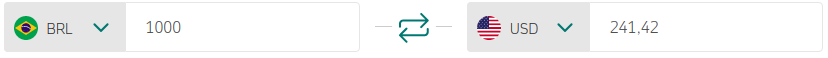
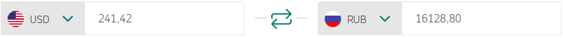
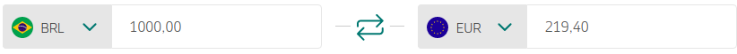
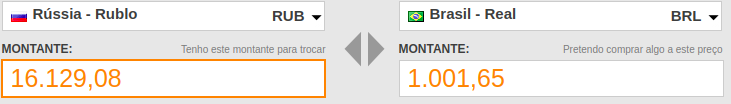

# Projeto Betina Currency

Esse projeto tem o objetivo de encontrar a melhor 
sequência de cambios de uma moeda para outra.

# Cenário

Imagine o seguinte cenário. Você tem R$1.000 Reais e quer converter Rublos.
Porém essa conversão não é comum em casas de câmbio, e a maioria delas 
somente trocam real para dolar ou euro.

Você conhece uma outra casa de câmbio que tem Rublos para trocar, porém ela 
só aceita dolar e euro.

Bem, eu posso primeiro comprar dolar/euro e depois trocar para rublos. Mas 
será que tanto faz o caminho real->euro->rublo ou real->dolar->rublo? 
Será que o montante final é o mesmo?

# Simulação

As taxas de câmbio dessa simulação foi baseada nos valores monetários do dia 1 de setembro de 2019, com base no site da [Uol](https://economia.uol.com.br/cotacoes/cambio/).

## 1° Cenário

Eu primeiro faço o câmbio de R$1.000,00 Reais para $241.42 Dolares

  

Então faço o câmbio de $241.42 Dolares para ‎₽16.128,80 Rublos.

  

#### **Resultado** 

Ok, no primeiro cenário consegui ‎₽16.128,80 Rublos

## 2° Cenário

Agora vamos fazer o câmbio de R$1.000,00 Reais para 
€219,40 Euros

  

E então fazemos o câmbio de €219,40 Euros para ₽16.129,08 Rublos

  

#### **Resultado** 
Ok, no segundo cenário consegui ‎₽16.128,80 Rublos

## Opa! 

Eu fiquei com ₽0,28 centavos de Rublos a mais quando fiz o 
caminho Real -> Euro -> Rublo

Parece besteira né, mas e se inves de R$1.000 Reais eu 
tivesse R$1.000.000,00 de reais? Aí eu teria ₽280 a mais...

Bem... Continua parecendo besteira.

## E se...

Mas agora imagina que eu saia com os meus ₽16.129,08 Rublos
e encontre uma terceira corretora que faça o câmbio Rublo-Real.

Lá eu descubro que os meus ₽16.129,08 Rublos podem ser 
trocados por R$1.001,65 Reais!!!

  

## Opa! Comecei com R$1.000,00 e terminei com R$1.001,65

# Agora é só farmar

  

## Hmm... Não sei não Rick...

Bem... Talvez não seja tão simples assim... Existem taxas 
de câmbio, se você quiser comprar 1 milhão de euros talvez 
a casa de câmbio não tenha, e se isso funcionasse eu não 
estaria aqui contando pra você...

Maaaaas o escopo desse projeto será simples sim!!

E se eu fiquei Bilionário foi porque eu mereci!!

  

# Objetivo

Modelar um grafo ponderado direcionado com as cotações monetárias de diversas casas de câmbio.

As informações que precisam ser obtidas são:
    
* Qual é a melhor sequência de cambio de uma moeda para outra.

* Existe algum ciclo positivo?

# Algoritmos

Com base no requisito de poder descobrir o menor caminho 
de uma moeda para qualquer outra moeda, uma boa abordagem 
seria utilizar o algoritmo de [Floyd-Warshall](https://github.com/edsomjr/TEP/blob/master/Grafos/slides/SSP-3/SSP-3.pdf).

Esse algoritmo computa a distância mínima entre todos os 
pares de vértices conectados em uma execução com a 
complexidade O(V³) e retorna as queries em O(1).

